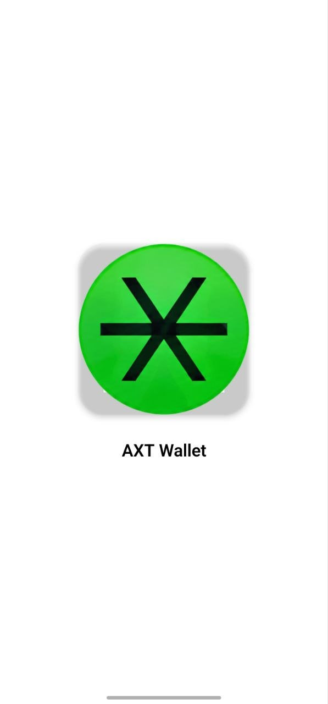
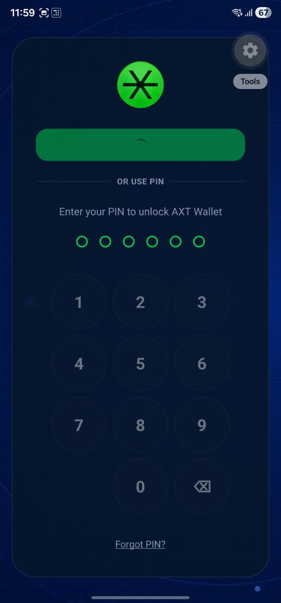
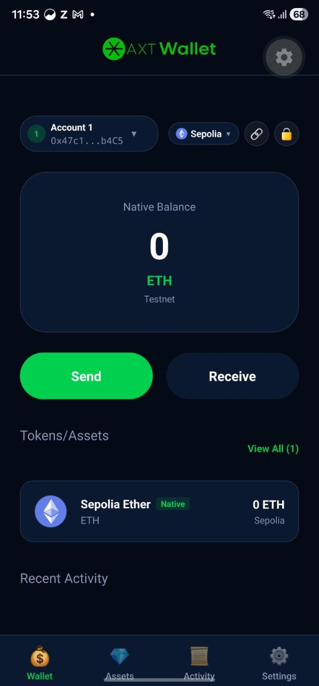
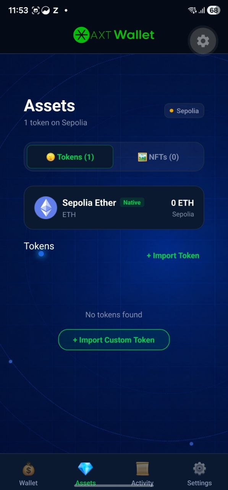
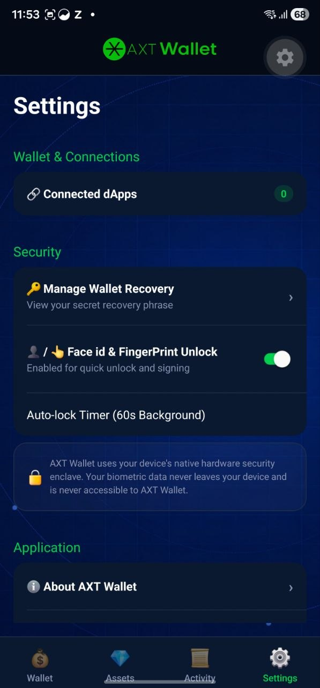
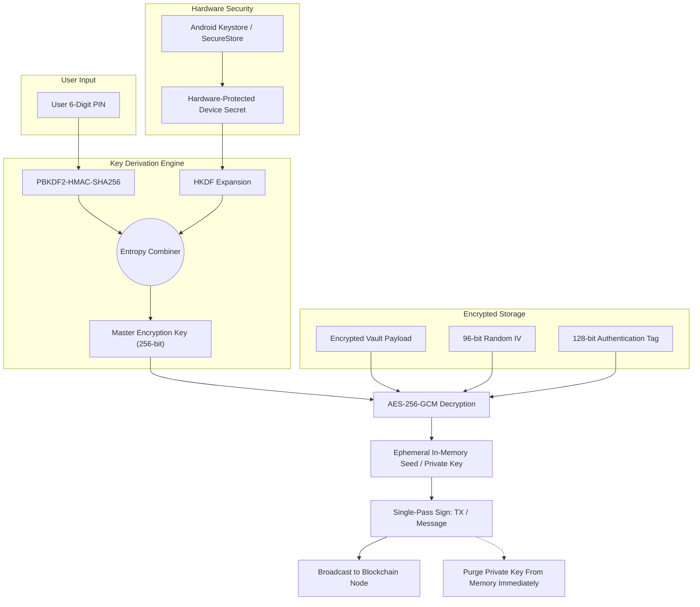

# 🛡️ AXT Wallet — Decentralized Non-Custodial Mobile Wallet

<div align="center">

  

  <h3>Next-Generation Non-Custodial Multi-Chain Web3 Wallet for Android</h3>

  <p align="center">
    <b>Empowering users with hardware-level cryptographic isolation, zero-knowledge seed security, seamless multi-chain EVM management, and native WalletConnect v2 dApp connectivity.</b>
  </p>

  <p align="center">
    <a href="#-key-features"></a>
    <a href="#-tech-stack"></a>
    <a href="#-tech-stack"></a>
    <a href="#-security-architecture"></a>
    <a href="#-multi-chain-ecosystem"></a>
    <a href="#-walletconnect-v2"></a>
    <a href="#-license"></a>
  </p>

  <p align="center">
    <a href="https://expo.dev/accounts/velvosoft/projects/AXTwallet-app/builds/3d05ed1a-a3db-4bb5-a8b7-3fc7ada04a7b">
      
    </a>
  </p>

  <p align="center">
    🚀 <b>Direct APK Download:</b> <a href="https://expo.dev/accounts/velvosoft/projects/AXTwallet-app/builds/3d05ed1a-a3db-4bb5-a8b7-3fc7ada04a7b"><b>Get AXT Wallet on your Android Device</b></a>
  </p>
</div>

---

## 📱 Visual Showcase & Interface Tour

<div align="center">
  <table>
    <tr>
      <th width="33%" align="center"><b>🔐 Biometric & PIN Security</b></th>
      <th width="33%" align="center"><b>💼 Portfolio Dashboard</b></th>
      <th width="33%" align="center"><b>🪙 Multi-Asset & Token Engine</b></th>
    </tr>
    <tr>
      <td align="center">
        
        <br />
        <sub><i>Hardware-backed 6-digit PIN pad with biometric Face ID / Fingerprint unlock & progressive lockout.</i></sub>
      </td>
      <td align="center">
        
        <br />
        <sub><i>Real-time native balance display, multi-account switcher, instant network selector & quick actions.</i></sub>
      </td>
      <td align="center">
        
        <br />
        <sub><i>Deep asset inspection, native & ERC-20 token tracking, custom token import, and balance overview.</i></sub>
      </td>
    </tr>
    <tr>
      <th colspan="2" align="center"><b>⚙️ Advanced Security & dApp Session Controls</b></th>
      <th align="center"><b>✨ Brand Identity</b></th>
    </tr>
    <tr>
      <td colspan="2" align="center">
        
        <br />
        <sub><i>Connected dApps manager, seed recovery management, auto-lock timers, and hardware enclave status.</i></sub>
      </td>
      <td align="center">
        
        <br />
        <sub><i>AXT Wallet secure decentralized brand mark.</i></sub>
      </td>
    </tr>
  </table>
</div>

---

## 🌟 Key Features & Engineering Highlights

### 🔒 Enterprise-Grade Hardware & Cryptographic Security
- **Hardware-Backed Keystore:** Master Encryption Keys (MEK) are stored inside the device's native hardware security enclave via Android Keystore (`expo-secure-store`). Sensitive keys never touch unsecured persistent storage.
- **Authenticated Vault Encryption:** Vault data is secured using military-grade **AES-256-GCM** with random 96-bit initialization vectors (IV) and PBKDF2-HMAC-SHA256 / HKDF key derivation.
- **Ephemeral Single-Pass Signing:** Private keys are derived only at the instant of transaction or message authorization, held in memory solely for the signature pass, and immediately zeroed out. Private keys never persist in unencrypted state.
- **Progressive PIN Lockout & Biometrics:** Enforces exponential backoff penalties for repeated failed PIN attempts, paired with Android Biometric Authentication (`expo-local-authentication`) for frictionless yet impenetrable protection.
- **Anti-Screen Capture Defense:** Integrated screen capture masking (`expo-screen-capture`) stops third-party apps and background processes from recording or capturing recovery seed phrases.

### 🌐 Multi-Chain EVM & Resilience Engine
- **Pre-Configured Networks:** Out-of-the-box support for Ethereum Mainnet, Sepolia Testnet, Arbitrum One, Optimism, Polygon PoS, BNB Smart Chain, and Base.
- **Dynamic Custom EVM Network Engine:** Add, inspect, and edit custom EVM chains on the fly with live on-chain RPC pinging, chainId validation, and duplicate detection before saving.
- **Intelligent RPC Failover:** Powered by ethers.js provider abstraction that automatically shifts from primary RPC endpoints (e.g. Alchemy) to redundant public fallbacks during network congestion or downtime.

### 💼 BIP-39 / BIP-44 Multi-Account Engine
- **Mnemonic Generation & Recovery:** Generates cryptographically secure 12-word BIP-39 recovery phrases with a built-in verification quiz to ensure safe user backup.
- **Deterministic HD Derivation (`m/44'/60'/0'/0/x`):** Derive unlimited isolated sub-accounts from a single master seed. Switch accounts, customize account names, and manage individual addresses seamlessly.
- **Vault Recovery Mechanism:** Secure seed-phrase verification wizard that safely re-encrypts the vault with a newly defined 6-digit PIN in case of forgotten credentials.

### 🪙 Multi-Asset & Token Hub
- **Native & ERC-20 Support:** Real-time multi-asset balances queried dynamically using atomic multicall patterns.
- **Custom Token Engine:** Validate ERC-20 contract code directly on-chain, automatically query metadata (`name`, `symbol`, `decimals`), and manage custom token watchlists.
- **Live Market Pricing:** Integrated CoinGecko API market feed displaying real-time USD equivalent valuations with in-memory caching to minimize rate-limiting and maximize responsiveness.

### ⚡ Transaction Lifecycle & Gas Optimization
- **EIP-1559 & Legacy Gas Estimation:** Real-time gas calculation with fee breakdown (Max Priority Fee, Max Fee Per Gas) and native currency conversion.
- **Send & Receive Flow:** Sleek UI with native QR code generation, address clipboard integration, gas fee review modal, and PIN-authorized broadcast.
- **Unified Transaction History:** Blends local submitted transactions with indexed on-chain explorer history (Alchemy Transfers API & Etherscan/BscScan).

### 🔗 Production WalletConnect v2 Integration
- **Universal dApp Connectivity:** Powered by `@walletconnect/web3wallet` (v2.24), allowing pairing via QR scan or `wc:` URIs.
- **Granular Session Management:** Inspect dApp metadata, select bound account addresses, approve or restrict chain permissions, and revoke active sessions with a single tap.
- **EIP-1193 RPC Routing:** Fully handles `eth_sendTransaction`, `personal_sign`, and `eth_signTypedData_v4` (EIP-712) with transparent parameter preview modals before PIN authorization.

---

## 🏗️ Architecture & Directory Structure

```
AXT_wallet/
├── assets/                          # Static assets, fonts, icons & promotional screenshots
│   ├── images/
│   │   ├── gitcover/               # High-res GitHub preview and showcase imagery
│   │   └── tabIcons/               # Navigation tab bar iconography
├── src/
│   ├── app/                        # Expo Router v4 file-based routing architecture
│   │   ├── (auth)/                 # PIN unlock, set-pin, and recovery wizards
│   │   ├── (main)/                 # Main authenticated tabs: index, assets, activity, settings
│   │   ├── (onboarding)/           # Welcome, create wallet (BIP-39), and import seed flows
│   │   ├── actions/                # Modal sheets: send tokens, receive (QR code)
│   │   ├── _layout.tsx             # Root provider hierarchy & deep link orchestration
│   │   └── index.tsx               # Security gatekeeper & routing discriminator
│   ├── blockchain/                 # Web3 & decentralized blockchain infrastructure
│   │   ├── balances/               # Native & ERC-20 balance fetching services
│   │   ├── history/                # Explorer APIs & Alchemy unified transaction indexer
│   │   ├── hooks/                  # Custom React hooks (useWalletBalance, useSendTransaction, etc.)
│   │   ├── networks/               # Multi-chain network configurations & RPC validators
│   │   ├── prices/                 # CoinGecko live pricing service & caching
│   │   ├── providers/              # Ethers JsonRpcProvider singleton with fallback resilience
│   │   ├── tokens/                 # ERC-20 ABI definitions, token registry, contract inspectors
│   │   ├── transactions/           # EIP-1559 gas estimator, transaction builder & broadcaster
│   │   └── walletconnect/          # Web3Wallet client, pairing services, EIP-1193 request handlers
│   ├── components/                 # Reusable atomic UI components
│   │   ├── accounts/               # Account switcher, creation, and rename modals
│   │   ├── networks/               # Network selector & custom RPC addition modals
│   │   ├── tokens/                 # Custom ERC-20 token import modal
│   │   ├── ui/                     # Design system primitives (Button, Input, PinPad, Screen)
│   │   └── walletconnect/          # Connection proposal & signature authorization modals
│   ├── context/                    # React Context State Providers
│   │   ├── AuthContext.tsx         # Session authentication & vault status
│   │   ├── AccountContext.tsx      # Multi-account HD state & switching
│   │   ├── NetworkContext.tsx      # Active chain state & custom RPC registry
│   │   └── WalletConnectContext.tsx# Active dApp sessions & approval requests
│   ├── security/                   # Cryptographic engine & hardware keystore
│   │   ├── encryption/             # AES-256-GCM authenticated cipher & PBKDF2/HKDF key derivation
│   │   └── secure-storage/         # Android Keystore hardware-backed secure storage
│   ├── storage/                    # Persistent storage layer (AsyncStorage wrappers)
│   └── wallet/                     # Account management, vault service, and cryptographic derivation
│       ├── auth/                   # PIN verification, lockout backoff, and recovery logic
│       ├── crypto/                 # BIP-39 mnemonic engine & BIP-44 key derivation
│       └── vault/                  # Encrypted vault lifecycle & migration management
└── tests/                          # Automated Jest test suites (crypto, vault, auth, balance, networks)
```

---

## 🛠️ Technology Stack

| Layer | Technologies |
| :--- | :--- |
| **Framework & Engine** | [React Native 0.86](https://reactnative.dev/) • [Expo SDK 57](https://expo.dev/) • [Expo Router v4](https://docs.expo.dev/router/introduction/) |
| **Programming Language** | [TypeScript 6.0](https://www.typescriptlang.org/) (Strict Mode) |
| **Web3 & Blockchain** | [Ethers.js v6.17](https://docs.ethers.org/) • [WalletConnect v2.24](https://docs.walletconnect.com/) (`@walletconnect/web3wallet`) |
| **Cryptography** | [@noble/ciphers](https://github.com/paulmillr/noble-ciphers) (AES-256-GCM) • [@noble/hashes](https://github.com/paulmillr/noble-hashes) (PBKDF2, SHA256) |
| **Hardware & OS Security** | `expo-secure-store` (Android Keystore / TEE) • `expo-local-authentication` (Biometrics) • `expo-screen-capture` |
| **UI & Experience** | Custom Glassmorphic Dark Design System • `react-native-reanimated` • `react-native-gesture-handler` |
| **State & Persistence** | React Context API • `@react-native-async-storage/async-storage` |
| **Testing & Tooling** | [Jest 29](https://jestjs.io/) • [ts-jest](https://kulshekhar.github.io/ts-jest/) • ESLint Expo Standard • Metro Bundler with Polyfills |

---

## 🔐 Cryptographic & Vault Security Model



> **Security Guarantee:** At no point is the raw private key or mnemonic phrase stored in unencrypted memory or persisted to flash storage. Decryption only occurs ephemerally during PIN-confirmed actions and is immediately scrubbed from the JS runtime heap.

---

## 🚀 Getting Started & App Download

### 📲 Direct Android APK Download (Recommended)

Get the pre-compiled Android build immediately without setting up a local development environment:

[-00C853?style=for-the-badge&logo=android&logoColor=white)](https://expo.dev/accounts/velvosoft/projects/AXTwallet-app/builds/3d05ed1a-a3db-4bb5-a8b7-3fc7ada04a7b)

👉 **[Download AXT Wallet APK Build](https://expo.dev/accounts/velvosoft/projects/AXTwallet-app/builds/3d05ed1a-a3db-4bb5-a8b7-3fc7ada04a7b)**

1. Open the download link on your Android smartphone browser.
2. Download the generated `.apk` installation package.
3. Tap the file in your notifications or download manager to install (*allow "Install unknown apps" if prompted*).
4. Open **AXT Wallet**, set up your 6-digit PIN, verify your 12-word recovery seed, and begin managing your Web3 portfolio!

---

### 💻 Local Development Setup

### Prerequisites
- **Node.js**: v18.0.0 or higher
- **npm** or **yarn**
- **Android Studio** (with Android SDK & configured emulator) OR a physical Android phone running **Expo Go**

### 1. Installation

```bash
# Navigate to the project directory
cd "D-Apps/AXT_wallet ( Decentralized wallet Android Application)"

# Install dependencies
npm install
```

### 2. Run the Development Server

```bash
# Start Expo development bundler
npm start

# Run directly on an Android emulator or connected USB device
npm run android

# Run on iOS simulator (macOS required)
npm run ios
```

### 3. Build with EAS (Expo Application Services)

```bash
# Install EAS CLI globally
npm install -g eas-cli

# Configure build profile
eas build:configure

# Build standalone Android APK
eas build -p android --profile preview
```

---

## 🧪 Testing Suite

AXT Wallet includes comprehensive unit tests verifying the cryptographic integrity, vault isolation, authentication backoff logic, and balance utilities.

```bash
# Execute unit test suites
npm test

# Run tests with code coverage report
npx jest --coverage
```

Test coverage includes:
- `tests/wallet/crypto.test.ts`: BIP-39 mnemonic generation, seed expansion, and BIP-44 key derivation.
- `tests/wallet/vault.test.ts`: AES-256-GCM vault encryption, decryption, authentication tag tampering detection.
- `tests/wallet/auth.test.ts`: PIN verification, progressive lockout duration calculations, and session lifetimes.
- `tests/blockchain/balance.test.ts`: Wei-to-Ether unit conversions, precision bounding, and RPC mock responses.
- `tests/blockchain/network.test.ts`: Network configuration assertions, RPC URL validations, and chainId matching.

---

## 📄 License

This project is licensed under the **MIT License** — see the [LICENSE](./LICENSE) file for details.

---

<div align="center">
  <b>Built with ❤️ for the decentralized future.</b>
</div>
