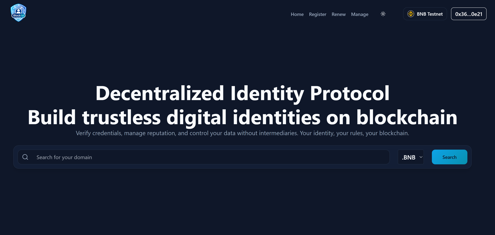

# BlockID - Your Web3 Identity on Blockchains

**BlockID** is a decentralized Web3 identity and domain registry built on blockchain technology. Own, manage, and communicate securely with your `.bnb` domain. BlockID provides a unified identity layer across multiple blockchain networks, enabling users to claim their digital identity in the decentralized web.

## 📸 Preview



## 🌟 Features

### Core Functionality
- **Domain Registration**: Register unique `.bnb` domains on the BNB Chain
- **Domain Management**: Full ownership and control over your decentralized domains
- **Domain Renewal**: Extend your domain ownership seamlessly
- **Multi-Chain Support**: Built to support multiple blockchain networks (starting with BNB Chain)
- **Wallet Integration**: Connect with MetaMask, Apollo Wallet, and other Web3 wallets via WalletConnect
- **Dark/Light Mode**: Beautiful theme switching for optimal user experience

### Developer Features
- **SDK & API**: Integrate `.bnb` domain resolution into any dApp
- **Smart Contract Integration**: Full ApolloID protocol implementation
- **Open Source**: Community-driven development and contributions

### User Experience
- **Responsive Design**: Works seamlessly across desktop and mobile devices
- **Real-time Validation**: Instant domain availability checking
- **Transaction Tracking**: Monitor your blockchain transactions
- **Intuitive Interface**: Clean, modern UI built with shadcn/ui components


## 🛠️ Tech Stack

### Frontend
- **React 18** - UI library
- **Vite** - Fast build tool and dev server
- **React Router** - Client-side routing
- **Tailwind CSS** - Utility-first CSS framework
- **shadcn/ui** - Beautiful, accessible UI components
- **Framer Motion** - Smooth animations
- **Radix UI** - Headless UI primitives

### Web3 Integration
- **Wagmi** - React hooks for Ethereum
- **RainbowKit** - Beautiful wallet connection UI
- **Viem** - TypeScript interface for Ethereum
- **Ethers.js v6** - Ethereum library
- **WalletConnect** - Multi-wallet connection protocol

### State Management & Data Fetching
- **TanStack Query (React Query)** - Server state management
- **React Hook Form** - Form validation
- **Zod** - TypeScript-first schema validation

### Development Tools
- **ESLint** - Code linting
- **PostCSS** - CSS processing
- **TypeScript** - Type safety (partial migration)

## 📦 Installation

### Prerequisites
- **Node.js** (v18 or higher) - [Install with nvm](https://github.com/nvm-sh/nvm#installing-and-updating)
- **npm** or **yarn** package manager
- **MetaMask** or another Web3 wallet (for testing)

### Setup

1. **Clone the repository**
   ```bash
   git clone https://github.com/yourusername/blockid.git
   cd blockid
   ```

2. **Install dependencies**
   ```bash
   npm install
   ```

3. **Environment Configuration**
   
   Create a `.env` file in the root directory:
   ```env
   VITE_WALLETCONNECT_PROJECT_ID=your_walletconnect_project_id
   ```
   
   Get your WalletConnect Project ID from [WalletConnect Cloud](https://cloud.walletconnect.com/)

4. **Start the development server**
   ```bash
   npm run dev
   ```
   
   The application will be available at `http://localhost:5173`

## 📖 Available Scripts

| Command | Description |
|---------|-------------|
| `npm run dev` | Start development server with hot reload |
| `npm run build` | Build for production |
| `npm run preview` | Preview production build locally |
| `npm run lint` | Run ESLint to check code quality |

## 🏗️ Project Structure

```
blockid/
├── public/                 # Static assets
│   ├── favicon.png        # Application favicon
│   └── ...
├── src/
│   ├── ABI/               # Smart contract ABIs
│   │   ├── ApolloIDToken.json
│   │   ├── ApolloIDRegistry.json
│   │   ├── ApolloIDRegistrar.json
│   │   ├── ApolloIDResolver.json
│   │   └── constant.js    # Contract addresses & ABIs
│   ├── assets/            # Images and media
│   ├── components/        # React components
│   │   ├── ui/           # shadcn/ui components
│   │   ├── Header.jsx
│   │   ├── Footer.jsx
│   │   ├── Hero.jsx
│   │   ├── Features.jsx
│   │   ├── FAQ.jsx
│   │   └── ...
│   ├── contexts/          # React contexts
│   │   └── ThemeContext.jsx
│   ├── hooks/             # Custom React hooks
│   │   ├── useWalletAddress.js
│   │   └── useUserDomain.js
│   ├── lib/               # Utility libraries
│   │   ├── apolloId.js   # Domain management logic
│   │   ├── web3.js       # Web3 configuration
│   │   ├── bnbChain.js   # BNB Chain config
│   │   └── contractConfig.js
│   ├── pages/             # Route pages
│   │   ├── Index.jsx     # Homepage
│   │   ├── Register.jsx  # Domain registration
│   │   ├── Manage.jsx    # Domain management
│   │   ├── Renew.jsx     # Domain renewal
│   │   └── ...
│   ├── App.jsx           # Main app component
│   ├── main.jsx          # Entry point
│   └── index.css         # Global styles
├── .env                  # Environment variables
├── package.json
├── vite.config.js
└── tailwind.config.js
```

## 🔗 Smart Contracts

BlockID integrates with the ApolloID protocol on BNB Chain Testnet (Chain ID: 97):

| Contract | Address |
|----------|---------|
| ApolloIDToken | `0xd1A80747Ca49010026d4ba8F9B457C18f9BFa7Ea` |
| ApolloIDRegistry | `0x317c278195c6Cd9B46A76C957A93Ad1283e1AF64` |
| ApolloIDRegistrar | `0x11F05DeF1945Ae4915B1Af935AADAd488C8a638C` |
| ApolloIDResolver | `0xaDcB08918Aab4d6B6BB726Af48e38F36BFf9A50f` |

**Note**: These are testnet addresses. Update with mainnet addresses when deploying to production.

## 🌐 Supported Networks

Currently supported:
- **BNB Chain Testnet** (Chain ID: 97)

Future support planned for:
- Ethereum Mainnet & Testnets
- Base
- Polygon
- APE Chain

## 🎨 Customization

### Theme
BlockID supports both light and dark modes out of the box. The theme preference is automatically saved and persisted across sessions.

### Styling
Built with Tailwind CSS, you can easily customize:
- Colors and gradients
- Spacing and layout
- Typography
- Component variants

Modify `tailwind.config.js` to customize the design system.

## 🧪 Testing

### Manual Testing Checklist
1. Connect wallet (MetaMask/WalletConnect)
2. Search for available domain names
3. Register a new domain
4. View domain details in Manage page
5. Renew an existing domain
6. Test theme switching
7. Verify responsive design on mobile

### Wallet Compatibility
Tested and working with:
- ✅ MetaMask
- ✅ WalletConnect compatible wallets
- ✅ Apollo Wallet
- ⚠️ Microsoft Edge (limited support - use Chrome/Brave/Firefox for best experience)

## 🚀 Deployment

### Build for Production
```bash
npm run build
```

The optimized production build will be generated in the `dist/` directory.

### Deployment Platforms

BlockID can be deployed to any static hosting platform:

- **Vercel**: `vercel deploy`
- **Netlify**: Drag and drop the `dist/` folder
- **GitHub Pages**: Use GitHub Actions for automated deployment
- **IPFS**: Decentralized hosting with `ipfs add -r dist/`

### Environment Variables for Production
Ensure you set the following environment variables in your deployment platform:
```env
VITE_WALLETCONNECT_PROJECT_ID=your_production_project_id
```

## 🤝 Contributing

Contributions are welcome! Please follow these steps:

1. Fork the repository
2. Create a feature branch (`git checkout -b feature/amazing-feature`)
3. Commit your changes (`git commit -m 'Add some amazing feature'`)
4. Push to the branch (`git push origin feature/amazing-feature`)
5. Open a Pull Request

### Development Guidelines
- Follow the existing code style
- Write meaningful commit messages
- Add comments for complex logic
- Test your changes before submitting

## 📄 License

This project is proprietary. All rights reserved.

© 2025 BlockID.io

## 🙏 Acknowledgments

- **ApolloID Protocol** - Smart contract infrastructure
- **RainbowKit** - Wallet connection UI
- **shadcn/ui** - Beautiful component library
- **Tailwind CSS** - Utility-first CSS framework
- **BNB Chain** - Blockchain network support

## 📞 Support & Community

- **Website**: [blockid.io](https://blockid.io) *(Update with your URL)*
- **Twitter/X**: [@BlockID](https://x.com/BlockID)
- **Instagram**: [@blockid](https://www.instagram.com/blockid)
- **LinkedIn**: [BlockID](https://www.linkedin.com/in/blockid)
- **GitHub**: [github.com/blockid](https://github.com/blockid)

## ⚠️ Important Notes

1. **Testnet Only**: Currently deployed on BNB Chain Testnet. Do not use real BNB.
2. **Wallet Security**: Never share your private keys or seed phrases.
3. **Browser Support**: For the best Web3 experience, use Chrome, Brave, or Firefox. Microsoft Edge has limited wallet support.
4. **Gas Fees**: All transactions require testnet BNB for gas fees.

## 🔮 Roadmap

- [ ] Mainnet deployment
- [ ] Multi-chain expansion (Ethereum, Polygon, Base)
- [ ] Domain marketplace
- [ ] Subdomain support
- [ ] Email integration (BNB Mail)
- [ ] Mobile app development
- [ ] Advanced domain metadata
- [ ] DAO governance

---

*Your Web3 Identity on Blockchains*
