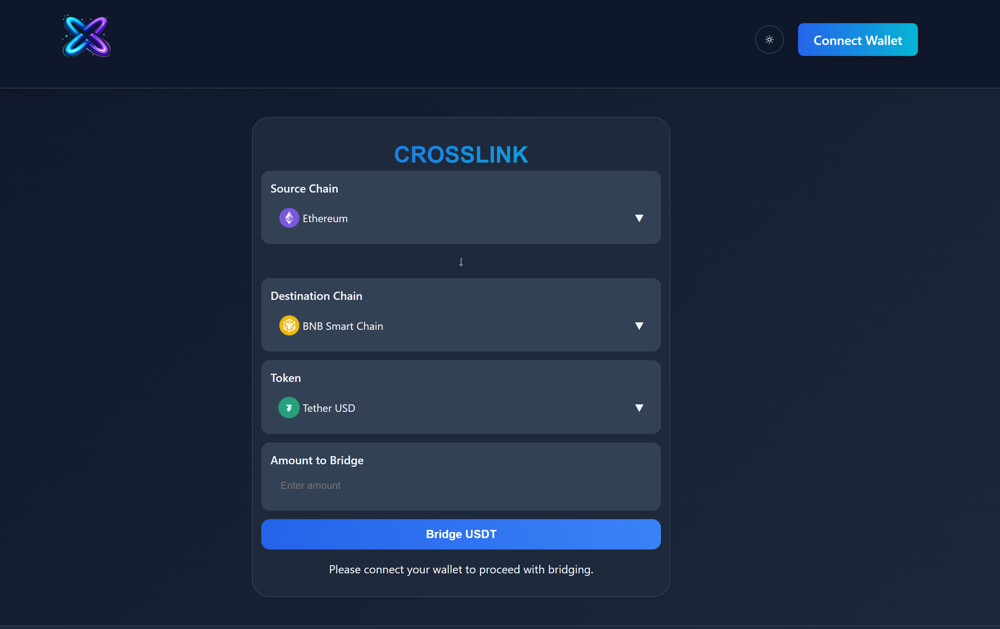

# 🚀 CROSSLINK Bridge

CROSSLINK is a professional, multi-chain decentralized application (dApp) designed to facilitate seamless asset bridging across various blockchain networks. Built with a focus on speed, security, and user experience, it provides a unified interface for transferring tokens between top-tier ecosystems.



## ✨ Features

- **Multi-Chain Support**: Bridge assets across Ethereum, BNB Smart Chain, Polygon, Arbitrum, Optimism, Avalanche, and Fantom.
- **Wide Token Selection**: Support for major stablecoins including USDT, USDC, DAI, BUSD, FRAX, TUSD, USDP, GUSD, LUSD, and sUSD.
- **Modern UI/UX**: A beautiful, responsive interface with Dark/Light mode support.
- **Seamless Wallet Integration**: Powered by RainbowKit for easy connection with MetaMask, WalletConnect, and more.
- **Real-time Feedback**: Live balance checking and transaction status tracking directly within the app.
- **Local Assets**: Optimized with local SVG logos for all supported chains to ensure fast load times and reliable asset display.

## 🛠️ Tech Stack

- **Framework**: [React 19](https://react.dev/)
- **Build Tool**: [Vite 7](https://vitejs.dev/)
- **Styling**: [Tailwind CSS 4](https://tailwindcss.com/)
- **Web3 Libraries**:
  - [Wagmi 2](https://wagmi.sh/) - React Hooks for Ethereum
  - [RainbowKit 2](https://www.rainbowkit.com/) - The best way to connect a wallet
  - [Viem 2](https://viem.sh/) - TypeScript interface for Ethereum
- **State Management**: [TanStack Query 5](https://tanstack.com/query/latest)

## 🚀 Getting Started

### Prerequisites

- [Node.js](https://nodejs.org/) (v18 or higher recommended)
- [npm](https://www.npmjs.com/) or [yarn](https://yarnpkg.com/)

### Installation

1. Clone the repository:
   ```bash
   git clone https://github.com/your-username/crosslynk-bridge.git
   cd crosslynk-bridge
   ```

2. Install dependencies:
   ```bash
   npm install
   # or
   yarn install
   ```

3. Start the development server:
   ```bash
   npm run dev
   # or
   yarn dev
   ```

4. Open [http://localhost:5173](http://localhost:5173) in your browser.

## 📦 Building for Production

To create an optimized production build:

```bash
npm run build
```

The output will be in the `dist/` directory.

## 🛡️ Security

This bridge uses a `burnForBridge` mechanism on source chains to ensure secure asset transfers. Always verify contract addresses before interacting with the bridge.


---

