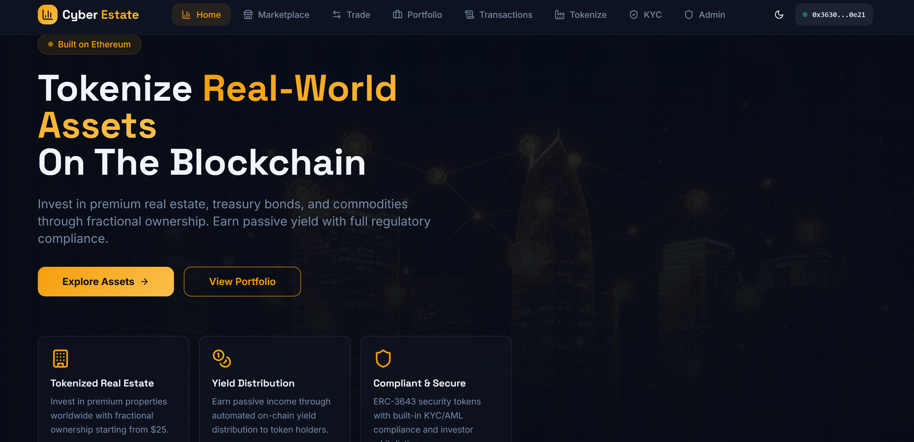
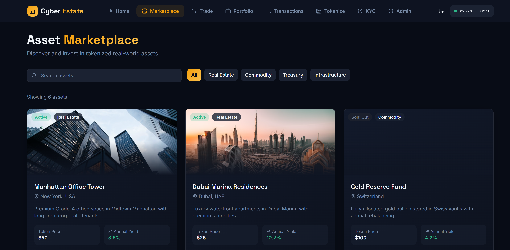
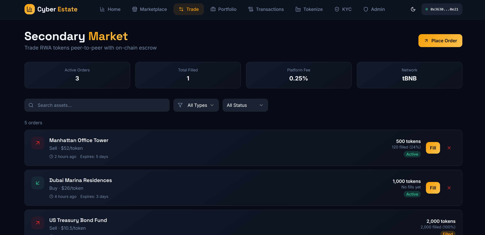
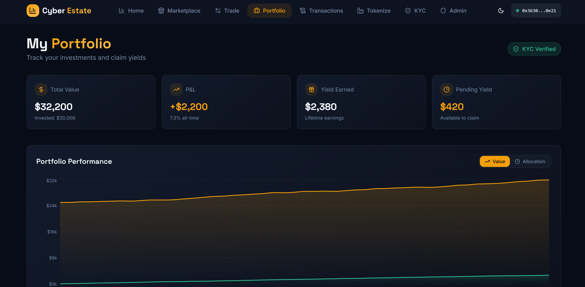

# 🏛️ Cyber Estate — Real World Asset (RWA) Tokenization Protocol

<div align="center">

  <h1>Institutional-Grade RWA Tokenization & Yield Protocol</h1>

  <p align="center">
    <b>Transforming illiquid physical real estate, treasury bonds, commodities, and infrastructure into compliant, liquid, and yield-bearing digital assets on BNB Smart Chain.</b>
  </p>

  <p align="center">
    <a href="#-protocol-architecture"></a>
    <a href="#-token-standards"></a>
    <a href="#-smart-contracts"></a>
    <a href="#-tech-stack"></a>
    <a href="#-tech-stack"></a>
    <a href="#-smart-contracts"></a>
    <a href="#-license"></a>
  </p>
</div>

---

## 📸 Visual Showcase & Interface Tour

<div align="center">
  <table>
    <tr>
      <th width="50%" align="center"><b>🌐 Hero Landing & Protocol Gateway</b></th>
      <th width="50%" align="center"><b>🏢 Primary Asset Marketplace</b></th>
    </tr>
    <tr>
      <td align="center">
        
        <br />
        <sub><i>Decentralized institutional portal featuring fractional property investment, on-chain compliance, and wallet integration.</i></sub>
      </td>
      <td align="center">
        
        <br />
        <sub><i>Filterable multi-asset catalog (Real Estate, Commodities, Treasuries) with real-time APY yield & pricing metrics.</i></sub>
      </td>
    </tr>
    <tr>
      <th width="50%" align="center"><b>🔄 P2P Secondary Trading & Escrow</b></th>
      <th width="50%" align="center"><b>📊 Investor Portfolio & Yield Distribution</b></th>
    </tr>
    <tr>
      <td align="center">
        
        <br />
        <sub><i>Trustless order book with on-chain atomic escrow, 0.25% protocol fee, partial fills, and live market depth.</i></sub>
      </td>
      <td align="center">
        
        <br />
        <sub><i>Net Asset Value (NAV) tracking, lifetime earnings, real-time pending yield claims, and interactive performance charts.</i></sub>
      </td>
    </tr>
  </table>
</div>

---

## 🌟 Key Features & Protocol Innovations

### 🏢 Fractional Real-World Asset Tokenization
- **Democratized High-Value Assets:** Invest in prime real estate (Manhattan towers, Dubai waterfront villas), gold reserves, and treasury bonds starting from as low as **$25**.
- **Multi-Tranche ERC-1155 Tokenization:** High-efficiency batch asset minting via `RWAAssetToken.sol`, supporting fractional share distribution with distinct metadata IDs per property.
- **Dynamic Valuation & Oracles:** Real-time asset valuation reflecting real-world appraised net asset value (NAV) and occupancy metrics.

### 🛡️ Institutional Compliance & On-Chain KYC/AML
- **ERC-3643 Security Token Compliance:** Utilizing `RWASecurityToken.sol` to enforce identity-bound transfer restrictions. Tokens can only be transferred between KYC-whitelisted wallets.
- **On-Chain Identity Registry (`KYCRegistry.sol`):** Tracks verification tiers (Retail, Accredited, Institutional), jurisdiction-specific compliance limits, and attestation expiration dates.
- **Investor Protection:** Prevents unauthorized wallet interactions, blacklists suspicious entities, and enforces country-specific regulatory criteria.

### 🔄 Non-Custodial Secondary P2P Order Book
- **Trustless Atomic Escrow (`RWAMarketplace.sol`):** Eliminates counterparty risk by locking asset tokens in smart contract escrow until buyer payments are executed.
- **Partial Order Fills:** Buyers can purchase arbitrary fractional amounts of open sell orders.
- **Low Protocol Fees:** 0.25% platform fee with transparent fee routing to dedicated treasury contracts.

### 💸 Automated Yield Streaming & Redemption
- **Real-Time Dividend Claims:** Rental income, interest payments, and commodity revenues are distributed on-chain in `RWAYieldToken.sol` and claimable directly via the user portfolio.
- **Formal Liquidity Redemptions (`RedemptionManager.sol`):** Structured redemption windows with automated cooldown periods, liquidation fees, and burn mechanics.

### 🧙 Complete Originator & Admin Governance Suite
- **Asset Tokenization Wizard:** Self-service issuance pipeline for real estate originators to submit asset specifications, IPFS documentation, and economic parameters.
- **Administrative Governance Panel:** Review and approve asset proposals, whitelist investors, configure protocol fee structures, and manage emergency circuit breakers.

---

## 📋 Deployed Smart Contract Registry (BNB Smart Chain Testnet)

All core protocol contracts are compiled with Solidity `0.8.20` with optimizer enabled (200 runs) and deployed on **BNB Smart Chain Testnet (Chain ID: 97)**:

| Smart Contract | Standard / Type | Deployed Testnet Address | BscScan Explorer Link |
| :--- | :--- | :--- | :--- |
| **`KYCRegistry`** | On-Chain Compliance Engine | `0xff6840c8A2C08093f57c4a7301Ed9f57D0D45D41` | [View on BscScan](https://testnet.bscscan.com/address/0xff6840c8A2C08093f57c4a7301Ed9f57D0D45D41) |
| **`RWAYieldToken`** | ERC-20 Yield Distribution | `0x7f8a7ea393E40c7D314EF0B8dF3545292F1D7814` | [View on BscScan](https://testnet.bscscan.com/address/0x7f8a7ea393E40c7D314EF0B8dF3545292F1D7814) |
| **`RWAAssetToken`** | ERC-1155 Fractional Asset | `0x537E66288890e9825C9b0C85850373106285311D` | [View on BscScan](https://testnet.bscscan.com/address/0x537E66288890e9825C9b0C85850373106285311D) |
| **`RWASecurityToken`** | ERC-3643 Permissioned Token | `0x9b4524ea7c4F75016fc774E3Ea1dF31230C4BB5D` | [View on BscScan](https://testnet.bscscan.com/address/0x9b4524ea7c4F75016fc774E3Ea1dF31230C4BB5D) |
| **`RWAMarketplace`** | P2P Escrow Order Book | `0x9Ac8c7a2BB33bF67dB3Af762731c120e5863CE76` | [View on BscScan](https://testnet.bscscan.com/address/0x9Ac8c7a2BB33bF67dB3Af762731c120e5863CE76) |
| **`RedemptionManager`** | Liquidity & Burn Gateway | `0xd72D9529874298B74612DF1160E68a8e691869bc` | [View on BscScan](https://testnet.bscscan.com/address/0xd72D9529874298B74612DF1160E68a8e691869bc) |
| **`RWAAssetFactory`** | Asset Creation Factory | `0xcC8d63F00A7C4c8b5cb37a4a788726d6Cd9e20bE` | [View on BscScan](https://testnet.bscscan.com/address/0xcC8d63F00A7C4c8b5cb37a4a788726d6Cd9e20bE) |

---

## 🛠️ Technology Stack

| Component | Technologies |
| :--- | :--- |
| **Frontend Framework** | [React 18.3](https://react.dev/) • [Vite 5.4](https://vitejs.dev/) • [TypeScript 5.8](https://www.typescriptlang.org/) |
| **Styling & Design System** | [Tailwind CSS 3.4](https://tailwindcss.com/) • [shadcn/ui](https://ui.shadcn.com/) (Radix UI Primitives) • Framer Motion |
| **Web3 & Blockchain** | [Ethers.js v6.13](https://docs.ethers.org/) • MetaMask Injected Provider • BNB Smart Chain (tBNB) |
| **Data & Charts** | [Recharts 2.15](https://recharts.org/) • [TanStack Query v5](https://tanstack.com/query/latest) • Date-fns |
| **Smart Contracts** | [Solidity 0.8.20](https://soliditylang.org/) • OpenZeppelin Contracts (ERC-20, ERC-1155, ReentrancyGuard, Ownable, Pausable) |
| **Testing & Quality** | [Vitest 3.2](https://vitest.dev/) • React Testing Library • ESLint 9 |

---

## 📁 Repository Structure

```
Cyber Estate ( Real World Asset Tokenization )/
├── contracts/                        # Core Solidity Smart Contracts
│   ├── KYCRegistry.sol              # On-chain KYC/AML verification & jurisdiction engine
│   ├── RWAAssetFactory.sol          # Asset creation factory & approval controller
│   ├── RWAAssetToken.sol            # ERC-1155 fractional ownership asset token
│   ├── RWAMarketplace.sol           # P2P secondary order book with atomic escrow
│   ├── RWASecurityToken.sol         # ERC-3643 permissioned security token implementation
│   ├── RWAYieldToken.sol            # ERC-20 dividend & rental yield token
│   ├── RedemptionManager.sol        # Token liquidation & redemption manager
│   └── README.md                    # Smart contract technical reference
├── src/
│   ├── assets/                      # High-resolution screenshots & graphic assets
│   │   ├── 1.PNG                    # Hero landing page screenshot
│   │   ├── 2.PNG                    # Asset marketplace showcase
│   │   ├── 3.PNG                    # Secondary trading order book showcase
│   │   ├── 4.PNG                    # Investor portfolio & yield chart showcase
│   │   └── hero-bg.jpg              # Hero background image
│   ├── components/                  # Atomic & domain-specific UI components
│   │   ├── ui/                      # shadcn/ui components (Dialog, Card, Button, Tabs, etc.)
│   │   ├── AssetCard.tsx            # Real estate & commodity asset card
│   │   ├── AssetPriceChart.tsx      # Interactive price history chart
│   │   ├── BuyAssetDialog.tsx       # Primary investment modal
│   │   ├── ClaimYieldDialog.tsx     # Dividend collection modal
│   │   ├── ConnectWallet.tsx        # Web3 wallet connection modal & network switcher
│   │   ├── HeroSection.tsx          # Landing page hero component
│   │   ├── KYCBadge.tsx             # Visual on-chain KYC status indicator
│   │   ├── Layout.tsx               # Master navigation header & footer wrapper
│   │   ├── MintAssetDialog.tsx      # Originator token minting dialog
│   │   ├── PortfolioCard.tsx        # Portfolio holding overview
│   │   ├── PortfolioCharts.tsx      # Recharts performance breakdown
│   │   ├── RedeemTokensDialog.tsx   # Liquidation redemption dialog
│   │   └── StatsSection.tsx         # Platform TVL & transaction metrics
│   ├── contexts/                    # Global React State Providers
│   │   └── WalletContext.tsx        # Web3 provider, signer, and active account management
│   ├── hooks/                       # Custom React hooks for Web3 contracts
│   │   ├── useContract.ts           # Ethers.js contract instance abstraction
│   │   ├── useFactory.ts            # Asset issuance interactions
│   │   ├── useKYC.ts                # Verification status & submission hook
│   │   ├── useMarketplace.ts        # Order book creation, filling & cancellation
│   │   ├── useRedemption.ts         # Redemption pipeline hook
│   │   └── useWallet.ts             # Account connection & balance state
│   ├── lib/                         # Contract ABIs, type definitions & utilities
│   │   ├── contracts.ts             # Deployed addresses & unified ABI exports
│   │   ├── mockData.ts              # Demo asset catalog data
│   │   ├── mockTransactions.ts      # Transaction history mock entries
│   │   └── types.d.ts               # Protocol TypeScript interfaces
│   ├── pages/                       # Application route views
│   │   ├── Admin.tsx                # Protocol governance & whitelist admin view
│   │   ├── AssetDetail.tsx          # Deep-dive property analytics & metrics
│   │   ├── Index.tsx                # Protocol landing page
│   │   ├── KYC.tsx                  # Investor verification submission form
│   │   ├── Marketplace.tsx          # Primary asset investment catalog
│   │   ├── Portfolio.tsx            # Investor holdings & dividend dashboard
│   │   ├── Tokenize.tsx             # Originator asset creation wizard
│   │   ├── Trade.tsx                # Secondary P2P trading order book
│   │   └── Transactions.tsx         # On-chain activity log
│   ├── App.tsx                      # Root router configuration
│   └── main.tsx                     # React application entrypoint
├── addresses.txt                    # Deployed testnet contract addresses reference
├── package.json                     # Dependency manifests & scripts
├── tailwind.config.ts               # Custom Tailwind styling & color scheme
└── vite.config.ts                   # Fast Vite development bundler configuration
```

---

## 🚀 Getting Started & Local Development

### Prerequisites
- **Node.js**: `v18.0.0` or higher
- **npm** or **bun**
- **MetaMask** browser extension configured with **BNB Smart Chain Testnet**
- **Testnet tBNB** for gas fees ([BNB Chain Faucet](https://www.bnbchain.org/en/testnet-faucet))

### 1. Installation

```bash
# Clone the repository
git clone https://github.com/AdityaSharma262/Frontend-Projects.git

# Navigate to the Cyber Estate project directory
cd "D-Apps/Cyber Estate ( Real World Asset Tokenization )"

# Install dependencies
npm install
```

### 2. Run the Development Server

```bash
npm run dev
```

Open your browser and navigate to `http://localhost:5173`.

### 3. Build for Production

```bash
npm run build
npm run preview
```

---

## 🧪 Testing Suite

```bash
# Run Vitest test suite
npm test

# Run tests in watch mode
npm run test:watch
```

---

## 📄 License

This project is open-source software licensed under the [MIT License](./README.md).

---

<div align="center">
  <b>Built with ❤️ for decentralized real-world finance.</b>
</div>
